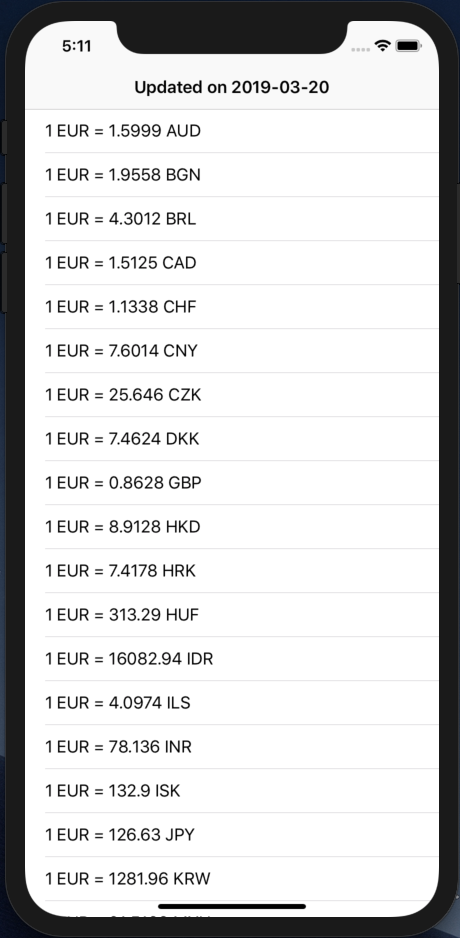
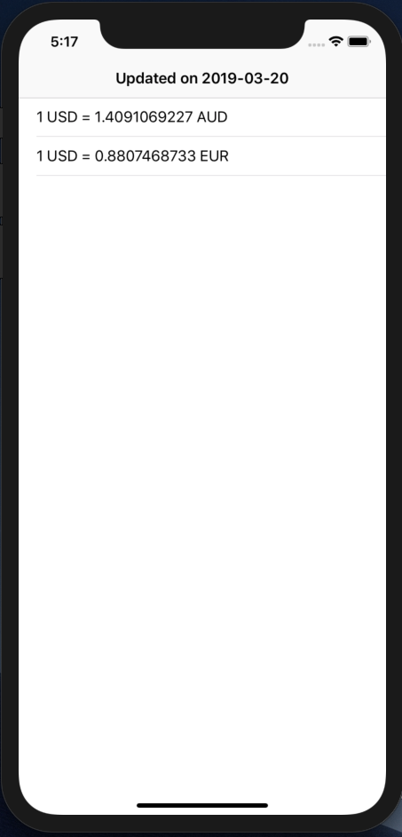

# Fetch exchange rate from free json api

This is final x code file from tutorial. [Click here to see the tutorial](https://apoorv.blog/fetch-exchange-rate-free-json-api-ios-swift/)

## Demo

Fetching exchange rate for all available currencies with base currency EUR

Fetching exchange rate for chosen currencies with base currency USD

## License

This project is licensed under MIT License - see LICENSE file for details.
